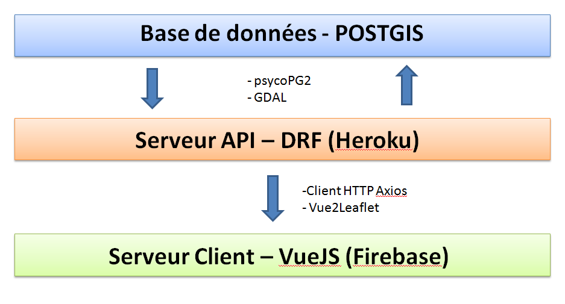
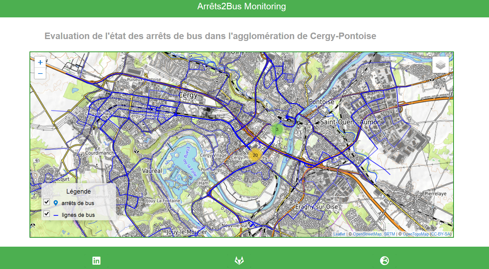
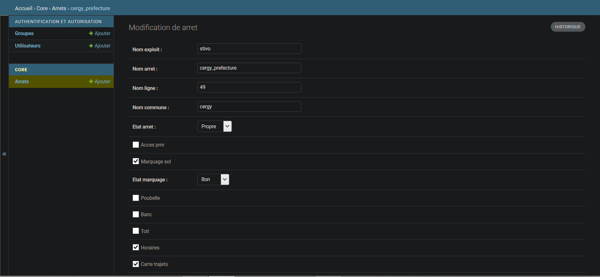
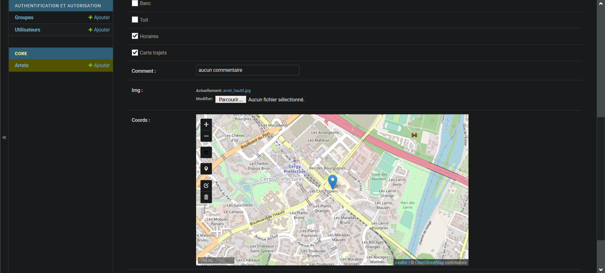
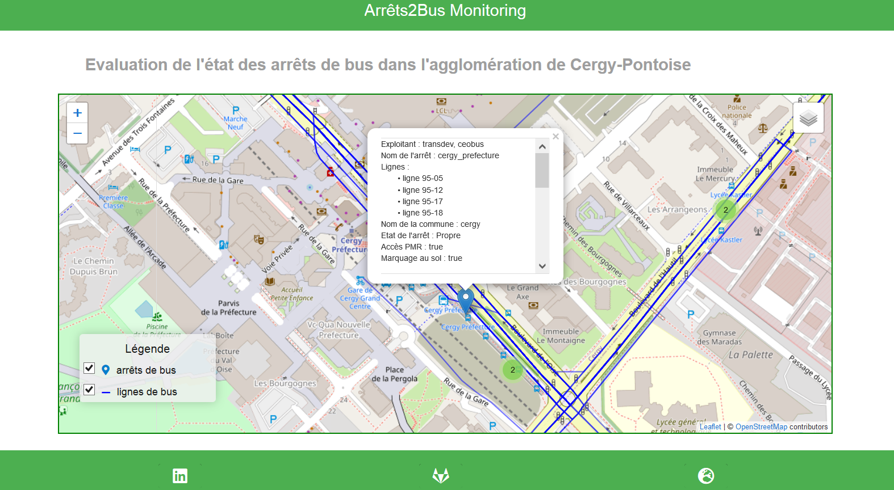

# Arrets2Bus - Monitoring
## Recensement de la qualité des arrêts de bus dans l'agglomération de Cergy-Pontoise

> Le projet consiste en l'évaluation de l'accessibilité des arrêts de bus par les usagers quotidiens, mais aussi la qualité du service mis à leur disposition qu'il soit destiné à les guider dans leurs itinéraires ou à l'attente du véhicule de transports en commun. L'exercice consiste à produire une application SIG-web au service des métiers du service Mobilités&Transports de l'agglomération à partir d'outils Open Source uniquement.

> Lien de l'application : [https://apps-ddc47.web.app/#/](https://apps-ddc47.web.app/#/)

> Lien de l'API : [https://busgisapi.herokuapp.com/api/arrets/?format=json](https://busgisapi.herokuapp.com/api/arrets/?format=json)

## Fonctionnement

Cette application fonctionne sur deux serveurs :
- le premier est un serveur backend déployé sur la plateforme Heroku et développé à partir du framework Django-Rest-Framework (python). Il stocke les données spatiales relevées sur le terrain avant de les redistribuer automatiquement à l'interface client;
- le second est un serveur frontend, déployé sur Firebase, qui accueille l'interface graphique développé en VueJS (javascript). Une carte interactive créée à partir de la librairie LeafletJS affiche chaque arrêt de bus évalué ainsi que les données attributaires relevées par les métiers de l'agglomération.



Le framework DjangoRestFramework et son module SIG DRF-gis facilitent la création de modèles de données spatiales et leur transfert vers une base de données PostGIS. Il offre également une interface administrateur simple à naviguer avec l'appui d'un canevas géographique qui accélère la création des données spatiales sur le terrain.

``` bash
# Liste des dépendances utilisées :
- Django
- Leaflet
- DjangoRestFramework
- DjangoRestFramework-GIS
- PsycoPG2
- GDAL

```




